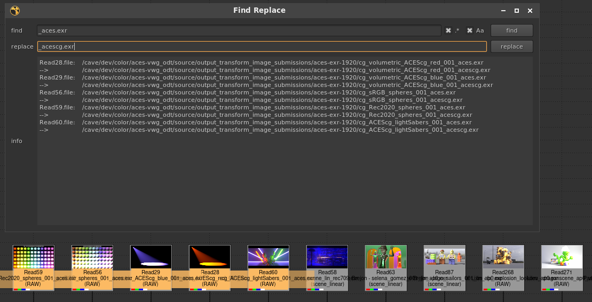

# Find Replace

`Ctrl + /` - A useful tool for searching for specific strings or patterns and replacing them.

## Features

- Supports optional regex patterns, and exact case matching. 
- Searches label knobs, text input knobs, and file knobs. 
- Searches the selected nodes, or all nodes if none are selected.
- Supports undo.
- Selects affected nodes after modification so you can see visually what where something was changed.